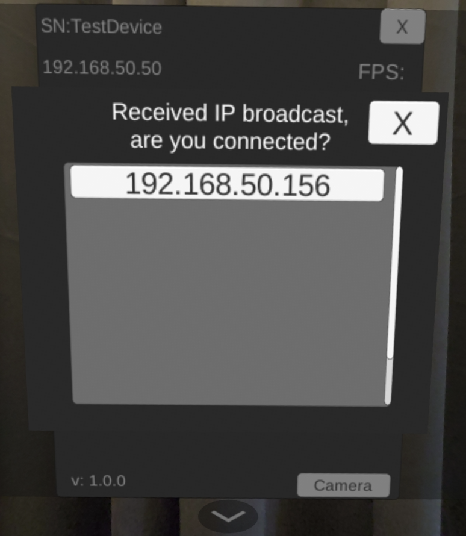
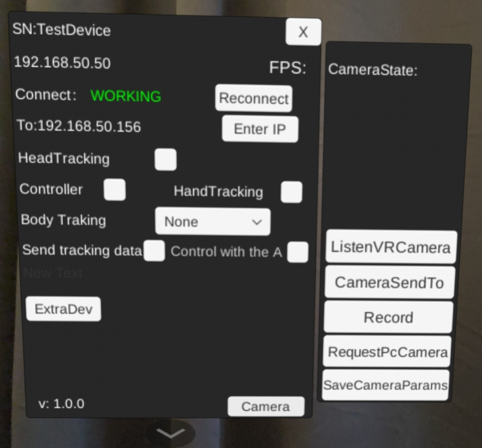

# XR-based Teleoperation on Bimanual UR5

This demo shows how to implement XR robotics toolkit to achieve robot teleoperation.

## Description


https://github.com/user-attachments/assets/288b3f30-11b8-458f-a596-a6c91a87a993


## Getting Started

### Dependencies

Before building the project, you must install the following dependencies:

* [Eigen](https://eigen.tuxfamily.org/) - C++ template library for linear algebra
* [ur-rtde](https://gitlab.com/sdurobotics/ur_rtde) - Real-Time Data Exchange library for Universal Robots
* [Dynamixel SDK](https://github.com/ROBOTIS-GIT/DynamixelSDK) - Software development kit for ROBOTIS Dynamixel actuators

> **Note:** This demo is developed and tested on Windows 10 and Ubuntu 22.04. This main branch only works on Linux system. If you want to run the demo on Windows PC, please refer to the [win_X86 branch](https://github.com/XR-Robotics/XRoboToolkit-Teleop-Sample-Cpp/tree/win_x86) of this repo.

## Installation

### 1. Install Required Libraries

#### Eigen
Download and install Eigen from the [official website](https://eigen.tuxfamily.org/). 

#### ur-rtde
Follow the installation instructions on the [ur-rtde repository](https://gitlab.com/sdurobotics/ur_rtde).

#### Dynamixel SDK
Follow the installation instructions on the [Dynamixel SDK repository](https://github.com/ROBOTIS-GIT/DynamixelSDK).

### 2. Clone the Repository

```bash
git clone https://github.com/XR-Robotics/XRoboToolkit-Teleop-Sample-Cpp.git
cd XRoboToolkit-Teleop-Sample-Cpp
```

### 3. Build the Project

```bash
mkdir build
cd build
cmake ..
cmake --build . --config Release
```

## Executing Program

1. Install **xr-robotics-toolkit.apk** on Pico 4 Ultra headset. Follow instructions on the [XR-robotics/unity demo repository](https://github.com/XR-Robotics/unity_demo.git).

2. Install **xr-robotics-toolkit robot server** on Linux PC. Follow instructions on the [XR-robotics/unity_demo repository](https://github.com/XR-Robotics/unity_demo.git).

3. Run XRoboToolkit-PC-Service:
   - Run `/opt/apps/roboticsservice/runService.sh`

4. Open xr-robotics-toolkit app on Pico 4 Ultra headset. Wait for the pop-up screen and select the IP address of the robot PC to connect. The main panel will display "Working" if connection is established.

   


5. On Unity main screen, once connection is confirmed:
   - Toggle `HeadTracking` On
   - Toggle `Controller` On
   - Toggle `Control with the A` On

   Follow instructions on "[full body pose sync between two XR headsets](https://github.com/XR-Robotics/unity_demo?tab=readme-ov-file#remote-stereo-vision-sync-between-two-xr-headsets) " for details on how to enable tele-vision between two headsets.

   
   

7. Execute main program from `build/Release/teleop_demo_UR5.exe`. Once UR5 arms and dynamixel motors are enabled without error messages:
   - Press A button on the right Pico controller to toggle `Send Tracking Data` On
   - The headset is now synced with the robot head movement
   - To teleoperate the UR5 robot arm, press and hold either left or right controller's Grip button

8. Note on using Dynamixel Motors on ubuntu. To enable serial communication, use the following command. 
```
sudo chmod a+rw /dev/ttyUSB0 //or your USB port
```


## License

This project is licensed under the MIT License - see the [LICENSE](LICENSE) file for details.

### Third-Party Licenses

This project uses the following third-party libraries:

* [Eigen](https://eigen.tuxfamily.org/) - Mozilla Public License 2.0
* [ur-rtde](https://gitlab.com/sdurobotics/ur_rtde) - MIT License
* [Dynamixel SDK](https://github.com/ROBOTIS-GIT/DynamixelSDK) - Apache License 2.0

